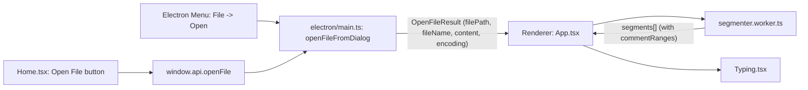

# CodeTyping Trainer — 架构说明

<p align="center">
  <a href="./ARCHITECTURE.md"><strong>English</strong></a> |
  <a href="./ARCHITECTURE.zh-CN.md"><strong>简体中文</strong></a>
</p>

CodeTyping Trainer 是一个本地离线的桌面打字练习应用：你可以打开任意本地文本/源码文件，按严格规则逐字符练习，并将每次练习的统计结果保存到本地，最后在 Analytics 中查看趋势（WPM / Unproductive%）。

本文面向项目维护者/贡献者，解释项目结构、Electron 进程协作、分段与“要打目标序列”的生成方式，以及 Typing 页如何在高性能约束下与 Monaco 协作渲染。

---

## 1) 技术栈与进程模型

### Renderer（渲染进程 / UI）
- **Vite + React + TypeScript**：页面 UI、路由（简易 in-app state router）、设置持久化、图表与键盘输入处理。
- **Mantine**：UI 组件与主题系统。
- **Monaco Editor**：只作为 *viewer / layout / decorations*；不启用 validation/markers/diagnostics。

入口：
- `src/main.tsx`：挂载 `MantineProvider`、`Notifications`、全局错误处理、App。
- `src/App.tsx`：渲染进程“路由” + 设置持久化 + 分段流程编排。

### Main（Electron 主进程）
职责：
- 创建窗口并确保安全配置（`contextIsolation: true`、`nodeIntegration: false`）。
- OS 菜单（`File → Open…`）与文件对话框。
- 本地文件读取与**编码识别**（Windows 常见 UTF‑8/BOM + GBK/GB18030）。
- attempts 持久化（JSON 写入 `app.getPath('userData')`）。

关键文件：
- `electron/main.ts`

### Preload（IPC 桥）
职责：
- 通过 `contextBridge` 暴露最小、安全 API 给 renderer。
- renderer 不直接访问 `fs`。

关键文件：
- `electron/preload.ts`

---

## 2) 目录结构导览（关键目录）

### `electron/`
- `electron/main.ts`：窗口/菜单、打开文件、解码、IPC handlers、attempt repo wiring。
- `electron/preload.ts`：`window.api.*` bridge。
- `electron/electron-env.d.ts`：preload API typings 与 build-time env。

### `src/pages/`
- `src/pages/Home.tsx`：入口页（Open File）。
- `src/pages/Loading.tsx`：分段时的 loading（避免大文件冻结 UI）。
- `src/pages/Typing.tsx`：核心练习体验（IME-friendly 输入、engine refs、Monaco viewer、常数级 decorations、Settings drawer、快捷键）。
- `src/pages/Summary.tsx`：保存 attempt 并展示本段结果。
- `src/pages/Analytics.tsx`：读取 attempts 并渲染列表 + 趋势图。

### `src/core/`（纯逻辑）
- `src/core/segmenter.ts`：`normalizeText()` + 按行分段（含 `maxSegmentChars` 保护）。
- `src/core/commentRanges.ts`：解析注释范围（C-like `//`/`/* */`，Python `#`/三引号）。
- `src/core/skipRanges.ts`：生成需要“跳过/不需要打”的 ranges（缩进、行尾空白、注释前对齐空格、空行等）。
- `src/core/typingEngine.ts`：严格 typing 状态机（slack/lock/backspace、skip-ranges、`typedEnd` 统计口径）。
- `src/core/metrics.ts`：WPM/Unproductive% 计算。

### `src/workers/`
- `src/workers/segmenter.worker.ts`：在 worker 中做 normalize + 全局注释解析 + 分段，并把注释范围切片成 segment-local ranges。

### `src/storage/`
- `src/storage/attemptRepo.ts`：存储接口（`add/list`）。
- `src/storage/jsonAttemptRepo.ts`：默认 JSON 持久化（主进程使用）。

### `build/`
- `build/afterAllArtifactBuild.cjs`：构建后重命名 `win-unpacked` 目录为稳定名称。
- `build/runElectronBuilder.cjs`：本地构建辅助（默认 `--publish never`，并处理 Windows 下偶发文件锁导致的重试/新输出目录）。

---

## 3) 核心数据流（端到端）

### 3.1 打开文件 → 分段 → Typing session（Mermaid 概览）



关键步骤：
1. **主进程**用 `fs.readFile` 读取 `Buffer`，通过 chardet + iconv-lite 解码（优先处理 GBK/GB18030），并返回 `OpenFileResult`（`electron/main.ts`）。
2. **渲染进程**接收 `content` 后把“normalize + 注释范围解析 + 分段”交给 `segmenter.worker.ts`（避免 UI 卡死）。
3. worker 返回 `segments[]`（每段包含 displayText、commentRanges 等），渲染进程进入 Typing 页开始练习。

---

## 4) Typing 引擎：目标序列、跳过策略与统计口径

### 4.1 为什么需要 “displayText vs typing target”

Typing 页需要“显示原文排版”（包括注释、对齐空格等），但并不一定要求用户把每一个可见字符都打出来：

- *Skip comments*：注释仍显示，但不需要输入。
- 行首缩进：可以显示，但可配置为不需要输入。
- 行尾空白：默认不需要输入（避免“莫名其妙的尾随空格”）。
- 空行：Enter 时可自动跳过连续空行（减少困惑）。

因此实现上使用“范围（ranges）+ 引擎跳过”的策略：引擎的 cursor 永远不会停留在 skippable ranges 内。

### 4.2 skipRanges 的来源

`src/core/skipRanges.ts` 会根据：
- commentRanges（来自 `src/core/commentRanges.ts`，worker 里全局解析后切片）
- Settings（skip comments / skip indentation / trim trailing whitespace / auto-skip blank lines 等）
计算“可跳过区间”（offset ranges），交给 engine 在推进 cursor 时自动跨越。

重要约束：
- skipRanges 的推进不会计入 typedKeystrokes，不会计入 incorrect/collateral/backspaces，也不会白嫖 WPM。

### 4.3 typedEnd：避免“自动跳过区域被染绿”

为了让“Skip comments（灰显）/跳过空白”在视觉上保持一致，engine 需要区分：
- `cursor`：逻辑位置（可能因为自动跳过而前进）
- `typedEnd`：用户真实按键推进到的位置（不包含自动跳过部分）

Typing 页的“正确前缀高亮”必须使用 `typedEnd` 而不是 `cursor`，否则自动跳过的注释/空白会被错误地高亮为“已正确输入”。

---

## 5) Monaco 的角色：只读 viewer + 常数级动态 decorations

### 5.1 Monaco 不参与输入

Typing 的输入由隐藏 `<textarea>` 捕获（支持 IME），Monaco 只负责：
- 文本展示（readOnly）
- 滚动/布局
- decorations（高亮“正确前缀/错误点/光标/注释灰显等”）

### 5.2 性能约束：每帧 decorations 常数级

为了保证长文件快速输入不卡顿：
- 动态 decorations（随每次输入变化）必须保持常数级（典型 3~4 个 range）。
- 注释灰显等“静态 decorations”只在切段/切换模式时一次性设置，按键时不更新它们。

### 5.3 关闭 Monaco “红色标记/验证提示”等噪声

项目明确禁止 Monaco 的校验视觉（segments 经常是不完整代码片段）：
- Editor options 关闭 validation/markers（例如 `renderValidationDecorations: 'off'` 等）
- TS/JS diagnostics 显式禁用
- 模型切换时清空 markers
- 额外注册 `tt-vs` / `tt-vs-dark` 自定义 theme 覆盖 “unexpected bracket” 的红色样式

---

## 6) 如何运行与调试（5 分钟上手）

```bash
npm install
npm run dev
```

测试：
```bash
npm run test
```

构建/打包：
```bash
npm run build
```

Debug overlay（可选，默认关闭）：
- Settings → “Show debug overlay”
- 或 `Ctrl+Shift+D`

该 overlay 用于排查输入卡顿，显示 lastKeyHandlingMs/lastDecorationUpdateMs/reactRenderCount 等指标（详见英文版架构文档与 Typing 页面实现）。

